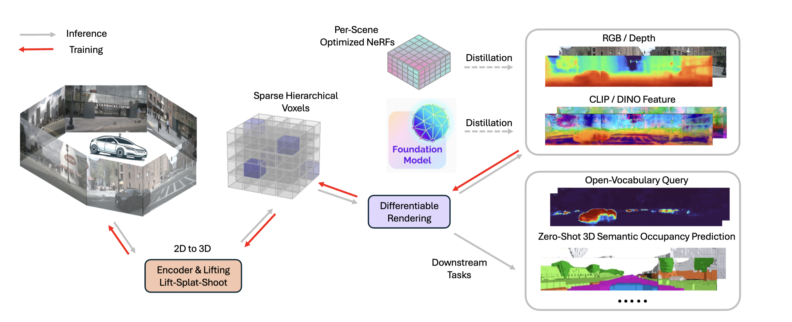

## DistillNeRF: Perceiving 3D Scenes from Single-Glance Images by Distilling Neural Fields and Foundation Model Features

<!--  -->

    

DistillNeRF is a generalizable model for 3D scene representation, self-supervised by natural sensor streams along with distillation from offline NeRFs and vision foundation models. It supports rendering RGB, depth, and foundation feature images, without test-time per-scene optimization, and enables zero-shot 3D semantic occupancy prediction and open-vocabulary text queries.

- [Capabilities](#Capabilities)
- [Comparison with SOTA methods](#Comparison-with-SOTA-methods)
- [Novel-view synthesis](#Novel-view-synthesis)

## Capabilities

    

Given single-frame multi-view cameras as input and without test-time per-scene optimization, DistillNeRF can reconstruct RGB images (row 2), estimate depth (row 3), render foundation model features (rows 4, 5) which enables open-vocabulary text queries (rows 6, 7, 8), and predict binary and semantic occupancy in zero shot (rows 9, 10).

## Comparison with SOTA methods

    

Our generalizable DistillNerf is on par with SOTA offline per-scene optimized NeRF method (EmerNerf), and significantly outperforms SOTA generalizable methods (UniPAD and SelfOcc).

## Novel-view synthesis
<!--  -->
Given single-frame multi-view cameras as input and without test-time per-scene optimization, we can synthesize novel views.

    

More demos and code coming soon! Stay tuned!

